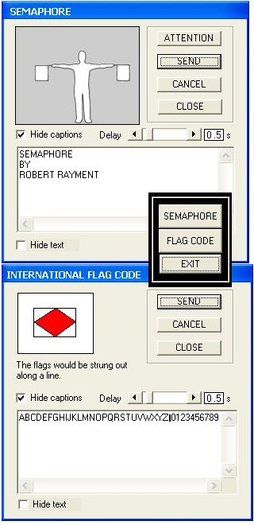



## Semaphore & the International Flag Code

### Description

Semaphore & the International Flag Code by Robert Rayment.  Enter any text and illustrate message using Semaphore or Ship flag codes. Learning aid. Straightforward code, easily embellished. (Zip 144 KB).
 
### More Info
 
Just run

             |
---                |---
**Submitted On**   |2004-10-20 09:23:00
**By**             |[Robert Rayment](https://github.com/Planet-Source-Code/PSCIndex/blob/master/ByAuthor/robert-rayment.md)
**Level**          |Beginner
**User Rating**    |4.8 (24 globes from 5 users)
**Compatibility**  |VB 6\.0
**Category**       |[Complete Applications](https://github.com/Planet-Source-Code/PSCIndex/blob/master/ByCategory/complete-applications__1-27.md)
**World**          |[Visual Basic](https://github.com/Planet-Source-Code/PSCIndex/blob/master/ByWorld/visual-basic.md)
**Archive File**   |[Semaphore\_18104810262004\.zip](https://github.com/Planet-Source-Code/robert-rayment-semaphore-the-international-flag-code__1-56937/archive/master.zip)

### API Declarations

Sleep & BitBlt

